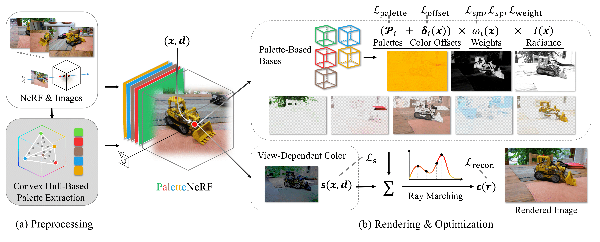
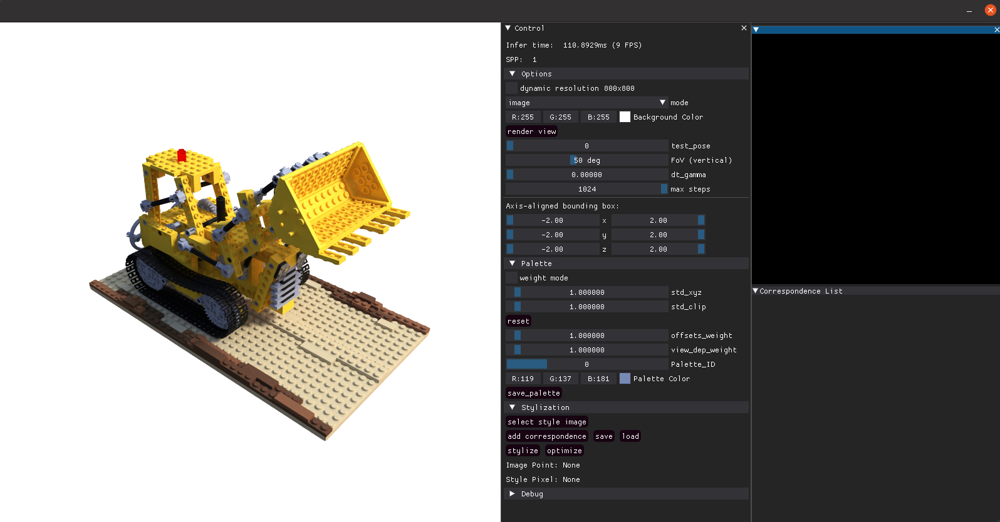

# <span style="color: #6ada43">P</span><span style="color: #f43233">a</span><span style="color: #9c7563">l</span><span style="color: #1fa0e7">e</span><span style="color: #eba602">t</span><span style="color: #eba602">t</span><span style="color: #1fa0e7">e</span>NeRF: Palette-based Appearance Editing of Neural Radiance Fields

### [Project Page](https://palettenerf.github.io) | [Paper](https://arxiv.org/pdf/2212.10699.pdf) 



This repository is the official PyTorch implementation of the method described in [
PaletteNeRF: Palette-based Appearance Editing of Neural Radiance Fields](https://palettenerf.github.io). It is based on the [ashawkey's implementation of Instant-NGP](https://github.com/ashawkey/torch-ngp) (i.e. torch-ngp).

This repository is tested in Ubuntu 20.04 + PyTorch 1.13.1 + RTX 3090.

<b>News: Our paper is accepted by CVPR 2023!</b>

# Install
```bash
git clone https://github.com/zfkuang/palettenerf.git
cd palettenerf
conda env create -f environment.yml
conda activate palettenerf
```

## Build extension (optional)
We provide two options to build extension, same as torch-ngp: loading the extension at run-time (which is much slower), or building the extension with `setup.py`:

```bash
bash scripts/install_ext.sh

# or
cd raymarching
python setup.py build_ext --inplace 
pip install . 
```

# Run

## Data Preparation
We use the same data format as torch-ngp does. Currently, three datasets are supported: [NeRF Synthetic Dataset](https://drive.google.com/drive/folders/128yBriW1IG_3NJ5Rp7APSTZsJqdJdfc1), [LLFF Dataset](https://drive.google.com/drive/folders/14boI-o5hGO9srnWaaogTU5_ji7wkX2S7) and [Mip-NeRF 360 Dataset](http://storage.googleapis.com/gresearch/refraw360/360_v2.zip). For LLFF and Mip-NeRF 360 Dataset, data conversion is required:
```bash
python scripts/llff2nerf.py /path/to/the/scene/directory --images images_4 --downscale 4 --datatype <llff/mip360>
```
for instance:
```bash
python scripts/llff2nerf.py ./data/nerf_llff_data/fern --images images_4 --downscale 4 --datatype llff
```

and everything is ready to go.

## Training
For convenience, we encapsulate all training and infering commands in `scripts/run_<dataset>.sh`. We also manually tuned some parameters of each scene for better reconstruction quality as torch-ngp suggested, and the configurations are under `scripts/configs_<dataset>`. To train our model, simply run (take `lego` as an example): 
```bash
bash scripts/run_blender.sh scripts/configs_blender/lego.sh -m nerf
bash scripts/run_blender.sh scripts/configs_blender/lego.sh -m extract
bash scripts/run_blender.sh scripts/configs_blender/lego.sh -m palette
```

## Running GUI
To edit the appearance with GUI, run the following command after the training is complete:
```bash
bash scripts/run_blender.sh scripts/configs_blender/lego.sh -m palette -g
```
A GUI window will automatically pop-up. Here's an example:


To understand how to operate the GUI, you can check our video demo provided in our [project page](https://palettenerf.github.io).

## Testing
To quantitatively evaluate our model or render test views, run:
```bash
bash scripts/run_blender.sh scripts/configs_blender/lego.sh -m palette -t
```

(Only available for LLFF and Mip-360 Dataset for now) To render a new video, run:
```bash
bash scripts/run_blender.sh scripts/configs_blender/lego.sh -m palette -v
```

The video trajectories are consistent with the original trajectories from NeRF and Mip-NeRF 360. 
All results are saved under `results_palette`.

## Semantic-guided editing
Currently our code only supports semantic-guided editing on Mip360 dataset. For convinience, we provide a modified implementation of paper [Language-driven Semantic Segmentation (LSeg)](https://github.com/isl-org/lang-seg) at ```third-party/lang-seg```. Follow the installization steps in the repo (make sure you are running it in an independent environment since it might not be compatible with ours), then run:
```bash
python extract_lseg_feature.py --datadir <path/to/data/of/mip360>
```
This script will generate compressed semantic feature maps of all training images. You can then train and test the model using the same commands by replacing ```-m palette``` to ```-m palette_lseg```.

## Model Zoo
coming soon

# Citation

We will highly appreciate it if you would like to cite our work via:
```
@article{kuang2022palettenerf,
  title={PaletteNeRF: Palette-based Appearance Editing of Neural Radiance Fields},
  author={Kuang, Zhengfei and Luan, Fujun and Bi, Sai and Shu, Zhixin and Wetzstein, Gordon and Sunkavalli, Kalyan},
  journal={arXiv preprint arXiv:2212.10699},
  year={2022}
}
```

# Acknowledgement

* The implementation of Instant-NGP is adapted from [torch-ngp](https://github.com/ashawkey/torch-ngp):
    ```
    @misc{torch-ngp,
        Author = {Jiaxiang Tang},
        Year = {2022},
        Note = {https://github.com/ashawkey/torch-ngp},
        Title = {Torch-ngp: a PyTorch implementation of instant-ngp}
    }

    @article{tang2022compressible,
        title = {Compressible-composable NeRF via Rank-residual Decomposition},
        author = {Tang, Jiaxiang and Chen, Xiaokang and Wang, Jingbo and Zeng, Gang},
        journal = {arXiv preprint arXiv:2205.14870},
        year = {2022}
    }
    ```
* The color palette extraction code is adapted from [posternerf](https://github.com/kenji-tojo/posternerf) with the method introduced in [Efficient palette-based decomposition and recoloring of images via RGBXY-space geometry](https://cragl.cs.gmu.edu/fastlayers/):
    ```
    @article{tojo2022posternerf,
	title = {Recolorable Posterization of Volumetric Radiance Fields Using Visibility-Weighted Palette Extraction},
	author = {Tojo, Kenji and Umetani, Nobuyuki},
	journal = {Computer Graphics Forum},
	number = {4},
	pages = {149-160},
	volume = {41},
	year = {2022}
    }

    @article{Tan:2018:EPD,
    author    = {Tan, Jianchao and Echevarria, Jose and Gingold, Yotam},
    title     = {Efficient palette-based decomposition and recoloring of images via RGBXY-space geometry},
    journal   = {ACM Transactions on Graphics (TOG)},
    volume    = {37},
    number    = {6},
    month     = dec,
    year      = {2018},
    articleno = {262},
    pages     = {262:1--262:10},
    numpages  = {10},
    issn = {0730-0301},
    doi = {10.1145/3272127.3275054},
    publisher = {ACM Press},
    address   = {New York, NY, USA},
    keywords  = {images, layers, painting, palette, generalized barycentric coordinates, convex hull, RGB, color space, recoloring, compositing, mixing}
    }
    ```

* The semantic segmentation code is adapted from the official implementation of paper [Language-driven Semantic Segmentation (LSeg)](https://github.com/isl-org/lang-seg):
    ```
    @inproceedings{
    li2022languagedriven,
    title={Language-driven Semantic Segmentation},
    author={Boyi Li and Kilian Q Weinberger and Serge Belongie and Vladlen Koltun and Rene Ranftl},
    booktitle={International Conference on Learning Representations},
    year={2022},
    url={https://openreview.net/forum?id=RriDjddCLN}
    }
    ```

* The GUI is developed with [DearPyGui](https://github.com/hoffstadt/DearPyGui).
